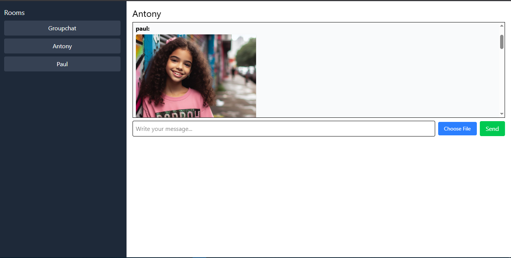

# 🧑‍💬 Real-Time Chat Application (MERN + Socket.io)

A feature-rich real-time chat application built using the MERN stack with **Socket.io**, **Multer** for image sharing, and modern UI with **Tailwind CSS**. Supports real-time messaging, typing indicators, file uploads, notifications, and more.

---

## 🚀 Project Overview

This application allows users to:
- Join public chat rooms
- Send and receive real-time text and image messages
- See typing indicators
- Get toast & browser notifications
- View unread message counts
- Enjoy a responsive and optimized user experience

---

## 🛠️ Tech Stack

**Frontend:**
- React
- Axios
- Socket.io-client
- Tailwind CSS
- React Hot Toast

**Backend:**
- Node.js
- Express.js
- MongoDB + Mongoose
- Socket.io
- Multer

---

## 📥 Setup Instructions

### 1. Clone the repository

```bash
git clone <url >
cd <folder structure >

cd server
npm install
# create .env file with MONGODB_URI and PORT
npm run dev

cd ../client
npm install
npm run dev

## screenshots 




